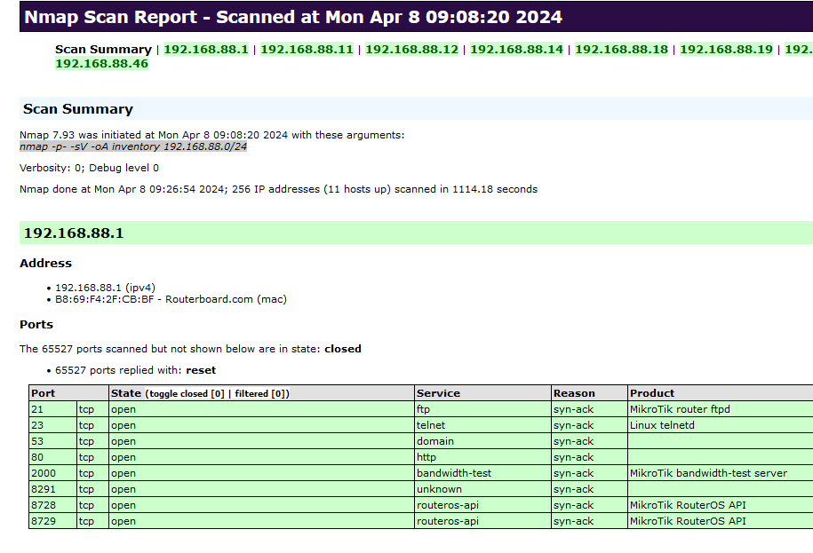

- [NMAP methodology](#nmap-methodology)
- [Fun tricks](#fun-tricks)
- [UDP scan](#udp-scan)
- [Generate random host list](#generate-random-host-list)
- [Fyodor against Microsoft](#fyodor-against-microsoft)
- [Better options for host discovery](#better-options-for-host-discovery)
- [some NSE script for DNS](#some-nse-script-for-dns)
- [ndiff](#ndiff)
- [inventory of our network](#inventory-of-our-network)
- [maxmind](#maxmind)

# NMAP methodology

Start with `-T4` and tune some parameters:

`--max-retries` is 6 by default (with -T4 timing template), we can go with 1 or 2

`--max-rtt-timeout` check first with `ping` or `nping` and set it accordingly

`--host-timeout` you should limit the maximum time that nmap will spend on a single host, possibly with no services at all. Set to 5 o 10 minutes

rif.

https://www.youtube.com/watch?v=okCNbKSdmDA

Remember to save output with `-oA`.

Later on you can use this tool to generate spreadsheet documents:

https://github.com/NetsecExplained/Nmap-XML-to-CSV

Open Excel, Data, import "From text/CSV"

N.B. if IP addresses aren't showing correctly, select "non rilevare tipi di dati" during CSV import.

Example:

```
$ sudo nmap -T4 -Pn -iL serverfarm.txt -p- --max-retries 2 --max-rtt-timeout 200ms -oA serverfarm
```

```
$ python3 /opt/tools/Nmap-XML-to-CSV/xml2csv.py -f serverfarm.xml -csv serverfarm.csv
```

Load csv into an empty Excel sheet ("non rilevare tipi di dati")

# Fun tricks

```
# nmap -Pn 192.168.88.0/24 -oA nmap-scan
```

to sort list of open ports:

```
grep " open " nmap-scan.nmap | sed -r 's/ +/ /g' | sort | uniq -c | sort -nr


     3 80/tcp open http
      3 22/tcp open ssh
      2 9010/tcp open sdr
      2 8000/tcp open http-alt
      2 443/tcp open https
      1 9000/tcp open cslistener
      1 8443/tcp open https-alt
      1 8291/tcp open unknown
      1 8009/tcp open ajp13
      1 8008/tcp open http
      1 554/tcp open rtsp
      1 53/tcp open domain
      1 5357/tcp open wsdapi
      1 445/tcp open microsoft-ds
      1 3389/tcp open ms-wbt-server
      1 23/tcp open telnet
      1 21/tcp open ftp
      1 2000/tcp open cisco-sccp
      1 139/tcp open netbios-ssn
      1 135/tcp open msrpc
      1 10001/tcp open scp-config
```

# UDP scan

```
# nmap -sU --min-rate 10000 <target>
```

# Generate random host list

```
nmap -iR 10 -sL -n
```

# Fyodor against Microsoft

```
nmap -v -O -sV -T4 --osscan-guess -oA ms-smbscan --script=smb-enum-domains,smb-enum-processes,smb-enum-sessions,smb-enum-shares,smb-enum-users,smb-os-discovery-smb-security-mode,smb-system-info [TARGET]
```

# Better options for host discovery

```
nmap -sP -PE -PP -PS21,22,23,25,80,113,31339 -PA80,113,443,100432 --source-port 53 -T4 -iL 50K_IPs
```

# some NSE script for DNS

```
nmap -v -PN -sU -p53 -T4 --script=dns-test-open-recursion,dns-safe-recursion-port.nse,dns-safe-recursion-txid.nse host1 ... host2...
```

# ndiff

to show "diff" between two nmap scan output

# inventory of our network

Run `nmap` with `-p-` (we want ALL ports) and `-sV` for version details. 

Save output in all supported formats (we are interested in XML).

```
$ sudo nmap -p- 192.168.88.0/24 -sV -oA inventory
```

To create a pretty HTML report of our scan:

```
$ xsltproc inventory.xml -o inventory.html
```



# maxmind

Download files:

GeoLite2-ASN_

GeoLite2-City_

GeoLite2-Country

Go to Preferences -> Name Resolution -> MaxMind Database Directories

Go to Statistics -> Endpoints -> map