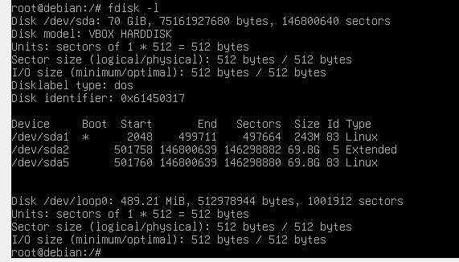

sto usando Gparted



`/dev/sda1` è la partizione di boot, riesco a mountarla


mm, così non riesco a mountare il file system di root…!


ah, mancava questo comando: `vgchange -ay` 

adesso posso accedere al filesystem!


la procedura dovrebbe essere:

```bash
mkdir /mnt/root_fs
modprobe dm-crypt
cryptsetup luksOpen /dev/sda5 nomedeldevice (nel mio esempio: crypt1)
(inserire password)
vgchange -ay
mount /dev/mapper/kaligra--vg-root /mnt/root_fs

```

per avere un’overview della situazione: `dmsetup table`


per chiudere:

```bash

umount /mnt/root_fs
lvchange -a a kaligra-vg (nome del virtual group)
cryptsetup luksClose nomedeldevice

```

# la mia vecchia kali del 2019


## /boot si mounta regolarmente


metto volontariamente la password sbagliata


metto la pass giusta:


attivo il “vg”


virtual group:


che peccato, mi fa mountare il logical volume, ma apparentemente c’è un *mischiume* di /boot , /etc …


il contenuto è palesemente sminchiato:

